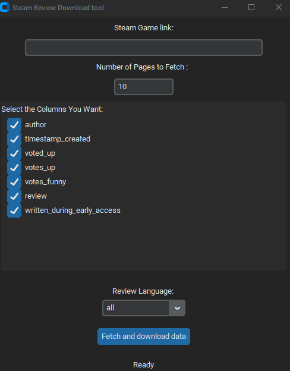

# Steam Review Scraper


A desktop application that allows users to download reviews for any Steam game in their desired language and quantity, with selectable data columns, saved as a clean CSV file.


 

---


### Features

* **Dynamic Data Fetching:** Fetch reviews by simply pasting the link of any Steam game.
* **Customizable Data Volume:** Control the number of reviews to download by specifying the number of pages to fetch.
* **Multi-Language Support:** Option to download reviews in a specific language (e.g., English, Turkish, German) or all languages.
* **Flexible Column Selection:** Choose the required data columns (author, playtime, review text, etc.) through the user interface.
* **Clean Output:** Save the selected data as a clean `.csv` file, ready for direct use in analysis.
* **User-Friendly Interface:** A modern and easy-to-use desktop application built with `CustomTkinter`.

---

### Technologies Used

This project was developed using the following technologies and libraries:

* **Python:** The main programming language.
* **CustomTkinter:** For designing the modern and user-friendly interface.
* **Pandas:** For processing, filtering, and saving data as a CSV file.
* **Requests:** For sending HTTP requests to the Steam Web API.

---

### Installation and Getting Started

Follow the steps below to run this project on your local machine.


#### Installation Steps

1.  **Clone the Project:**
    ```sh
    git clone [https://github.com/](https://github.com/)[YOUR-GITHUB-USERNAME]/[PROJECT-NAME].git
    ```

2.  **Navigate to the Project Directory:**
    ```sh
    cd [PROJECT-NAME]
    ```

3.  **Install the Required Libraries:**
    All necessary libraries for the project are listed in the `requirements.txt` file. You can install them all at once with the following command.
    ```sh
    py -m venv venv
    pip install -r requirements.txt
    ```

4.  **Run the Application:**
    ```sh
    python main.py
    ```

### Usage

1.  Run the application.
2.  Paste the Steam store link of the game you want to analyze.
3.  Specify the number of pages of reviews you want to fetch.
4.  Select the desired language for the reviews.
5.  Check the data columns you wish to download.
6.  Click the "Fetch and Download Data" button.
7.  In the dialog box that opens, choose the location and file name to save your file.

---

The project is still evolving. Feel free to open an issue to suggest a feature or submit your own pull request
